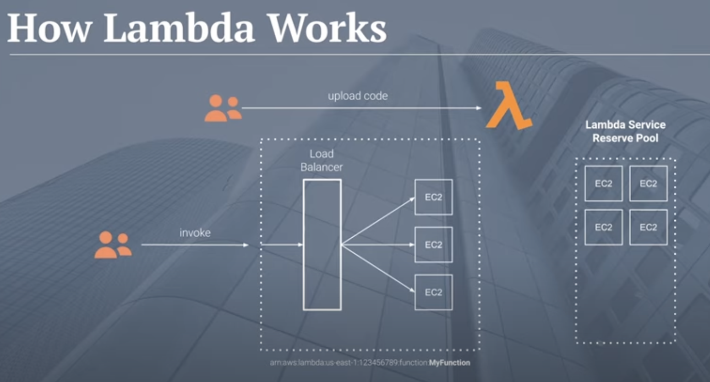
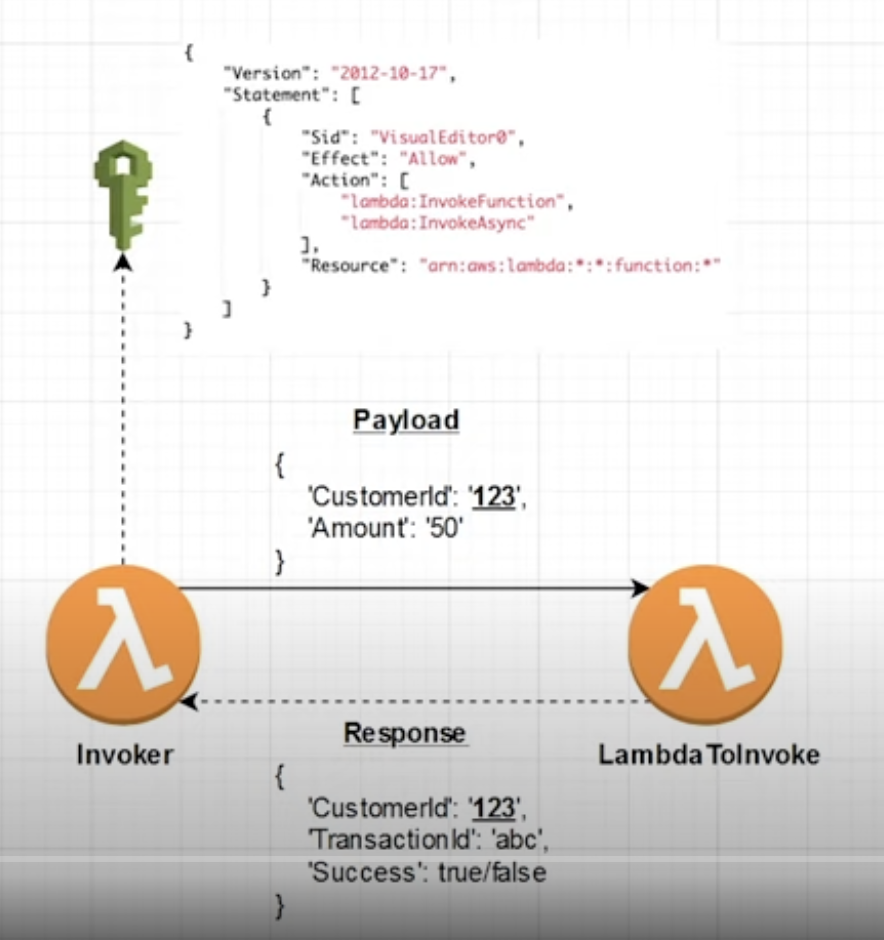
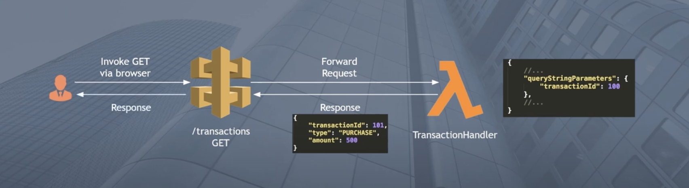
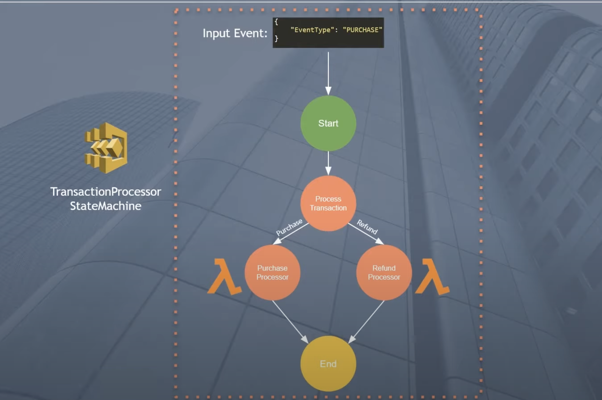
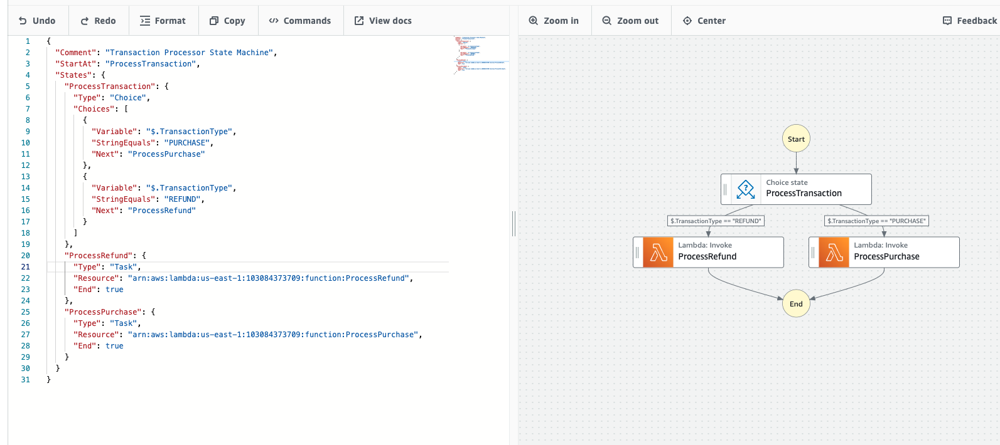
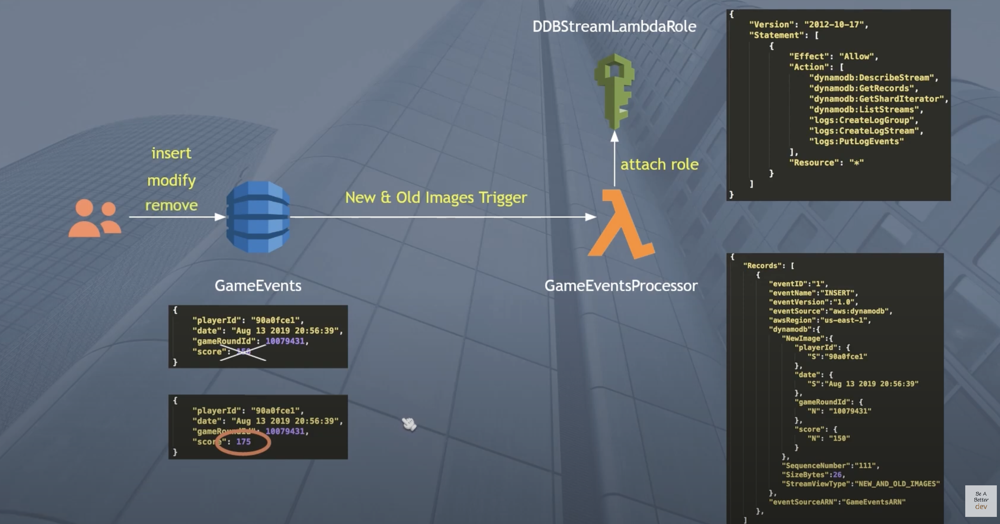
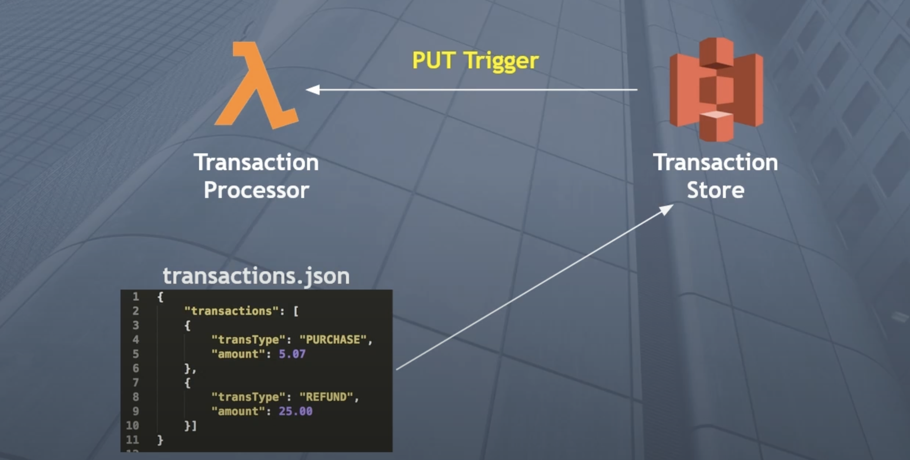

# AWS Lambda Guides

## AWS Lambda Introduction
- Run functions on demand without the server
- Supports many languages (python, java, c#, go, ruby, js)
- Adhoc tasks or completely serverless high TPS applications
- Pay per invocation, duration, memory
- Built in metrics with AWS Cloudwatch

## How lambda works


## Why is it so popular?
- Integrations with other AWS services
- API Gateway -> lambda(REST APIs)
- S3 -> lambda (Data processing)
- SQS -> lambda (Message Buffering & Processing)
- SNS -> lambda (Message Processing)
- Step functions -> lambda (Workflow Orchestration)
- DynamoDB -> lambda (Change Detection)

## Invoke AWS Lambda function from another Lambda function


- ARN(Amazon Resource Name) - ARN is important to call an aws service

LambdaToInvoke Function:
```
import json
import uuid

def lambda_handler(event, context):
    customerId = event["CustomerId"]
    transactionId = str(uuid.uuid1())

    return { "CustomerId": customerId, "Success": "true", "TransactionId": transactionId }
```

Invoker Function:
```
import json
import boto3

client = boto3.client("lambda")

def lambda_handler(event, context):
    inputForInvoker = { "CustomerId": "123", "Amount": 50 }

    response = client.invoke(
        FunctionName="ARN-link-of-LambdaToInvoke-function",
        InvocationType="RequestResponse" # Event Type
        Payload=json.dumps(inputForInvoker)
    )

    responseJson = json.load(response["Payload"])

    print(responseJson)
```

## API Gateway to Lambda



TransactionProcessor Lambda Function:
```
import json

print("Loading function")

def lambda_handler(event, context):
    transactionId = event["queryStringParameters"]["transactionId"]
    transactionType = event["queryStringParameters"]["type"]
    transactionAmount = event["queryStringParameters"]["amount"]
    
    print("TransactionId", transactionId)
    print("TransactionType", transactionType)
    print("TransactionAmount", transactionAmount)
    
    transactionResponse = {}
    transactionResponse["transactionId"] = transactionId
    transactionResponse["type"] = transactionType
    transactionResponse["transactionAmount"] = transactionAmount
    transactionResponse["message"] = "Success"
    
    responseObject = {}
    responseObject["statusCode"] = 200
    responseObject["headers"] = {}
    responseObject["headers"]["content-type"] = "application/json"
    responseObject["body"] = json.dumps(transactionResponse)
    
    return responseObject
```

## Step Function with Lambda


ProcessPurchase Lambda Function:
```
from __future__ import print_function

import json
import urllib
import boto3
import datetime

print("Loading function...")

def lambda_handler(event, context):
    
    print("Received message from Step Functions: ")
    print(event)
    
    response = {}
    response['TransactionType'] = event['TransactionType']
    response['Timestamp'] = datetime.datetime.now().strftime("%Y-%m-%d %H-%M-%S")
    response['Message'] = "Hello from lambda land inside the ProcessPurchase function"
    
    return response
```

* Create a IAM Policy for Step Function

Step Function Code:
```
{
  "Comment": "Transaction Processor State Machine",
  "StartAt": "ProcessTransaction",
  "States": {
    "ProcessTransaction": {
      "Type": "Choice",
      "Choices": [
        {
          "Variable": "$.TransactionType",
          "StringEquals": "PURCHASE",
          "Next": "ProcessPurchase"
        },
        {
          "Variable": "$.TransactionType",
          "StringEquals": "REFUND",
          "Next": "ProcessRefund"
        }
      ]
    },
    "ProcessRefund": {
      "Type": "Task",
      "Resource": "arn",
      "End": true
    },
    "ProcessPurchase": {
      "Type": "Task",
      "Resource": "arn",
      "End": true
    }
  }
}
```



## AWS DynamoDB Streams to Lambda


GameEventProcess Lambda:

```
import json

def lambda_handler(event, context):
    print("-------------------------")
    try:
        for record in events["Records"]:
            if record["eventName"] == "INSERT":
                handle_insert(record)
            elif record["eventName"] == "MODIFY":
                handle_modify(record)
            elif record["eventName"] == "REMOVE":
                handle_remove(record)
        print("-----------------------")
    except Exception as e:
        print(e)
        print("------------------")
        return "Oops!"

def handle_insert(record):
    print("Handling INSERT event")
    
    newImage = record["dynamodb"]["NewImage"]
    newPlayerId = newImage["playerId"]["S"]
    
    print("New row added with playerId=" + playerId)
    
    print("Done handling INSERT event")

def handle_modify(record):
    print("Handling MODIFY event")
    
    oldImage = record["dynamodb"]["OldImage"]
    oldScore = oldImage["score"]["N"]
    
    newImage = record["dynamodb"]["NewImage"]
    newScore = newImage["score"]["N"]
    
    if oldScore != newImage:
        print("Scores changed - oldScore" + str(oldScore) + ", newScore=" + str(newScore))
    
    print("Done handling MODIFY event")
    
def handle_remove(record):
    print("Handling REMOVE event")
    
    oldImage = record["dynamodb"]["oldImage"]
    
    oldPlayerId = oldImage["playerId"]["S"]
    
    print("Row removed with playerId = " + oldPlayerId)
    print("Done handling REMOVE event")

```

## AWS S3 file upload & Lambda Trigger


LambdaProcessor Transaction:
```
import urllib

def lambda_handler(event, context):
  bucket = event["Records][0]["s3"]["bucket"]["name"]

  key = urllib.parse.unquote_plus(event["Records"][0]["s3"]["object"]["key"], encoding="utf-8")

  try:
    response = s3.get_object(Bucket=bucket, Key=key)
    text = response["Body"].read().decode()
    data = json.load(text)

    print(data)

    transactions = data["transactions"]
    for record in transaction:
      print(record["transType"])
    return "Success"
  except Exception as e:
    print(e)
    raise e
```

## Download a S3 file from Lambda

TransactionsQueryFromS3 Lambda:
```
import json
import boto3

s3 = boto3.client("s3")

def lambda_handler(event, context):
    bucket = "aws-simplified-transactions-test"
    key = "transactions.json"
    
    response = s3.get_object(Bucket=bucket, Key=key)
    
    content = response["Body"]
    
    jsonObject = json.loads(content.read())
    
    transactions = jsonObject["transactions"]
    
    for record in transactions:
        print("TransactionType " + record["transactionType"])
        print("TransactionAmount " + str(record["amount"]))
        print("---------")

```
