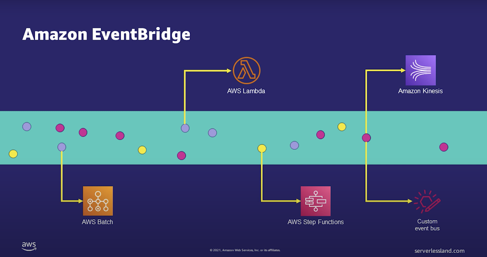
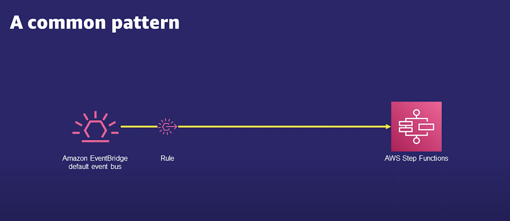

# Amazon EventBridge

#### What is amazon EventBridge?
Amazon EventBridge is a serverless event bus that makes it easier to build event-driven applications at scale using events generated from your applications, integrated Software-as-a-Service (SaaS) applications, and AWS services.

#### What is an Event?
1. Record of action
2. Represented as a JSON object
3. Meta data about the event
4. Data from the event

#### Comparing EventBridge to Amazon SQS
Event Bridge:
    - Processed one at a time
    - Can match multiple rules and be sent to multiple targets

SQS:
    - Events processed in batches
    - Events no longer available after successful processing